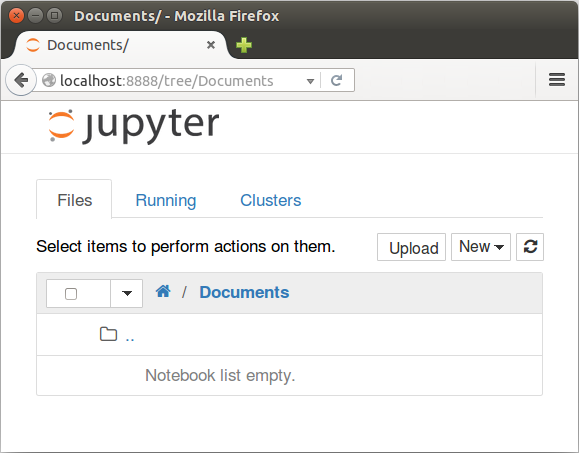
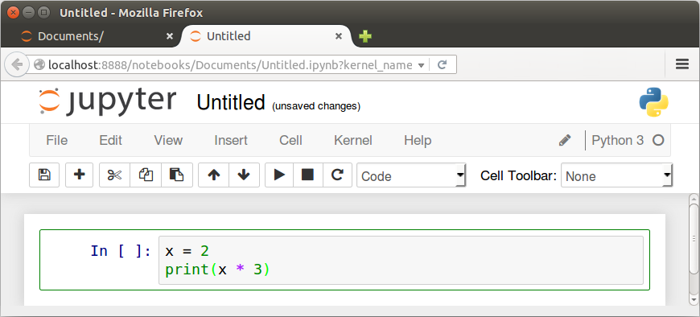
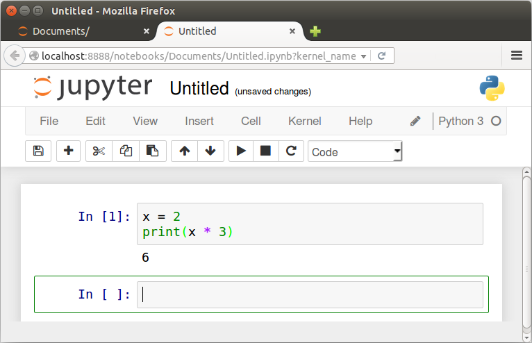
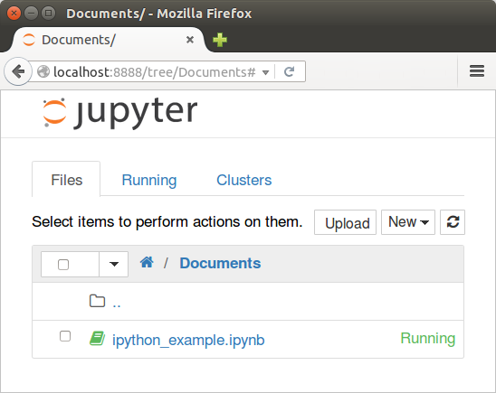

# Setup and Introduction

## How to install Python?

Python should be easy to install on basically all desktops and laptops. There are many different versions and flavors of Python. This class will be built around Python v3.6, but you will probably be fine using anything Python v3.3 or newer.

> **Please Note** The NumPy group [has said](https://github.com/numpy/numpy/blob/master/doc/neps/dropping-python2.7-proposal.rst) they will be dropping support for Python 2.X on Jan 1, 2020.  Since this library is the basis of nearly all science and engineering work in Python it will be very important that you move to Python 3.3 or newer soon.

#### Basic Python

The installation procedure depends on what operating system you have installed. [The Hitchhiker's Guide to Python](http://docs.python-guide.org/en/latest/) has a great description of how to install for the three major operating systems:

 * [Windows](http://docs.python-guide.org/en/latest/starting/install/win/)
 * [Mac OS X](http://docs.python-guide.org/en/latest/starting/install/osx/)
 * [Linux](http://docs.python-guide.org/en/latest/starting/install/linux/)

**NOTE**: The above guide also explains how to install SetupTools, Pip, and VirtualEnv. While these are great tools worth learning, and I highly encourage it, they are not yet necessary for this course.

#### Anaconda

I strongly recommend installing [Anaconda](http://docs.continuum.io/anaconda/install.html) instead. Anaconda is Python packaged with hundreds of tools and libraries you will want.

## How to Run Python Code

For the beginning student, there are three major ways to execute Python code: in the interpreter, as a script/program, and in a Jupyter notebook. In this class, you will be free to use which of these you want. But we will cover the strengths and weaknesses of each, so you can chose wisely.

### The Python Interpreter

Perhaps the easiest way to execute Python code is to use the Python interpreter. This is a handy Python feature not available in most other languages.

To start the Python interpreter, go to the "Command Prompt" in Windows or the "Terminal" in Mac OS / Linux. (From here on out I will call this the "command line".) Now the easy part, type `python`:

The Python interpreter should start right up, and you should see a prompt (`>>>`) to start entering Python code:

You can now enter valid Python code at the prompt:

Finally, to exit out of the interpreter, type `exit()`:

So, that's the interpreter. It's easy to use, comes standard with Python, and will be much the same on all computers.

**PRO TIP**: If you really want to learn Python, I recommend using the Python interpreter instead of a calculator, starting now. It will help you get used to the language basics. And it is vastly more powerful than any calculator.

### Python Scripts/Programs

The Python interpreter has one serious limitation: when you close the Python intepreter you lose all your work. What if you want to use your code again tomorrow? You will want to save your work. That is where Python scripts come into play.

To execute Python code as a script or a program, we first need to create a plain text file and give it the extension ".py". The classic first example in any language is to print "Hello, World!" to the screen. To do so, create a plain text file and add the text:

    print("Hello, world!")

Then save the file with the name "hello_world.py":

Now I can run the program from my command line by typing `python hello_world.py`:

And that's it! You can now write Python code and save it off for later use. This is how Python is typically written.

**NOTE**: Some people call them Python "scripts" and other people call them Python "programs". Broadly speaking, if the script gets complicated enough you call it a program. Don't worry about it though; these are not important distinctions.

**NOTE**: If you're coming from a language like Fortran or C, you'll notice we didn't need to compile our code. Because of this, we call Python an [interpreted language](https://en.wikipedia.org/wiki/Interpreted_language).

### Jupyter Notebooks

Lastly, in this class you might want to run Python code by using [Jupyter Notebooks](http://ipython.org/ipython-doc/stable/notebook/index.html). This is a solution designed for the daily work of scientists and engineers, and you will probably find it highly convenient. However, Jupyter doesn't come installed standard with Python, you will have to [download and install](http://jupyter.readthedocs.io/en/latest/install.html) it separately. Alternatively, I recommend installing [Anaconda](http://docs.continuum.io/anaconda/install.html), as it comes packaged with Jupyter.

Jupyter Notebooks are a flexible and easy-to-use Python interface for your web browser, designed more for our daily work: data exploration, statistics, quick plots, and tables. It is not ideally suited for large programs with many components. All of the code you write in Jupyter is saved in a special text file, like in a standard Python script.

To start a notebook, go to the command line and type `jupyter notebook`:

After a couple seconds your default web browser will open up and you will see a list of contents of your local directory:

Click "new" in the top-right corner and create a "notebook". This will give you an empty notebook to start working. Valid Python code can be entered in these cells:

Hit shift-and-enter to execute the code in your current cell. You will see a new cell to pop up below to continue your work:

To label your work, touch "Untitled" at the top of the page and you can give your Jupyter notebook a new file name:

If you close the tab in your web browser, or look at the first tab that was opened, you should see your new notebook file, with the extension `.ipynb`:

That's all you need to know to get started with Jupyter! But that's not all there is to know about Jupyter. It has a lot of handy tools to make your life easier. A popular tool is the ability to display tables and plots right in the notebook:

Jupyter is an ideal choice if you just want to do some quick thinking, data analysis, or plotting. It is also a friendly environment for a student to learn the language.

**NOTE**: Jupyter notebooks used to be called "iPython Notebooks". There was a name change because Jupyter notebooks now support more than just Python, but we won't worry about that in this class.

## Why Python?

> You'll never find a programming language that frees you from the burden of clarifying your ideas.

Every programming language has syntax; rules you have to learn. Python's rules are easier to learn than most, which helps you focus on what really matters. And after a few years of traction, there are a ton of libraries and tools written in Python for scientists and engineers. Learning to use tools can make your work a lot easier.

#### Batteries Included

That's the Python motto. The author of the first version of Python, [Guido von Rossom](http://en.wikipedia.org/wiki/Benevolent_dictator_for_life), has started a culture in the Python community that code should be easy to use. To that end, Python comes with a large collection of [standard libraries](https://en.wikipedia.org/wiki/Standard_library). These are tools to do the sorts of things that people frequently want to do with a computer programming language: complex math, random numbers, calendars, dates and times, dealing with *.zip files, communicating over the internet via HTTP, reading CSV files, you name it.

## How to make the most of this class

> Write code.

If you really want to learn the material in this class, there's only one solution: use what you learn.

As a starting point, there will be example problem sets at the end of each lecture. But don't stop there!

At the beginning of the class, maybe all you can do is replace your calculator with Python. As the class continues, you should be able to replace Excel with Python. Eventually, you should be able to do *all* your data analysis and scripting work in Python. But the trick is to start using what you learn every week at work, school, or home.

> Practice.

Start using Python daily. Make a GitHub account and start a silly Python project, just for fun.

#### Help Improve the Class

If you find this class useful, the best way you can repay me is to help me make it better. Help make it easier for people to spin up on Python and get working.

Example things I am interested in:

* Is a lecture unclear?
* Is there a grammatical error?
* Did you find a great reference for the "further reading" section?
* Do you have an idea to improve a lecture?

[Back to Syllabus](../../README.md)
