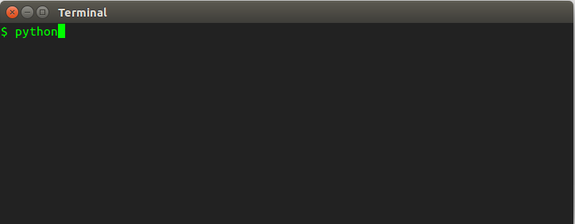
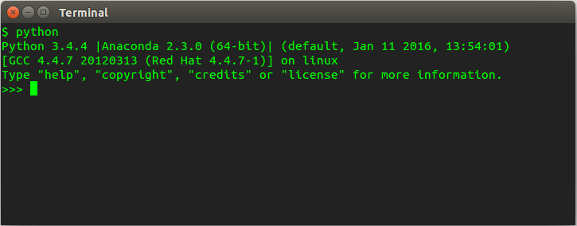
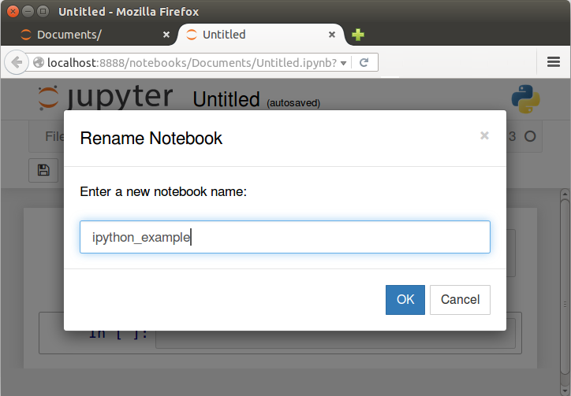
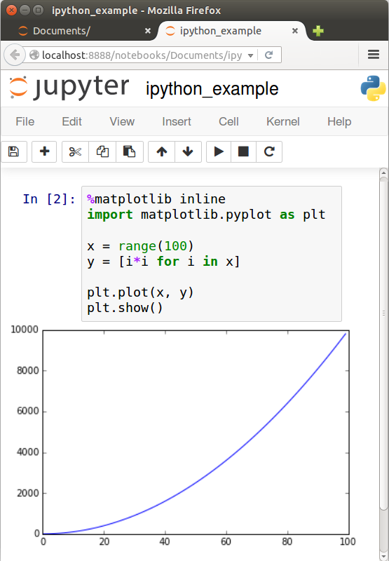

# Setup and Introduction

## How to install Python?

Python should be easy to install on basically all desktops and laptops. There are many different versions and flavors of Python. This class will be built around Python v2.7, but you will probably be fine using anything above Python v2.5.

#### Basic Python

The installation procedure depends on what operating system you have installed. [The Hitchhiker's Guide to Python](http://docs.python-guide.org/en/latest/) has a great description of how to install for the three major operating systems:

 * [Windows](http://docs.python-guide.org/en/latest/starting/install/win/)
 * [Mac OS X](http://docs.python-guide.org/en/latest/starting/install/osx/)
 * [Linux](http://docs.python-guide.org/en/latest/starting/install/linux/)

**NOTE**: The above guide also explains how to install SetupTools, Pip, and VirtualEnv. While these are great tools worth learning, and I highly encourage it, they are not yet necessary for this course.)

#### Anaconda

Consider installing [Anaconda](http://docs.continuum.io/anaconda/install.html) instead. Anaconda is Python packaged with hundreds of tools and libraries that you will want. I strongly recommend installing Anaconda for this class.

## How to Run Python Code

For the beginning student, there are three major ways to execute Python code: the interpreter, as a script/program, and using and iPython notebook. In this class, you will be free to use whichever of these you want. But you should know about the strengths and weaknesses of each, so you can chose wisely.

### The Python Interpreter

Perhaps the easiest way to execute Python code is to use the Python interpreter. This is not an optional available in most languages.

To start the Python interpreter, go to the "Command Prompt" in Windows, or the "Terminal" in Mac OS, Linux, or Unix. From here on out I will call this the "command line". Now the easy part, type `python`:

The Python interpreter should start right up, and you should see a prompt (`>>>`) to start entering Python code:

You can now enter valid Python code at the prompt:

Finally, to exit out of the interpreter, type `exit()`:

So, that's the interpreter. It's free, easy to use, comes standard with Python, and will be nearly exactly the same on all computers.

**PRO TIP**: If you really want to learn Python, I recommend using the Python interpreter instead of a calculator, starting now. It will help you get used to the language basics. And it is vastly more powerful than any calculator.

### Python Scripts/Programs

The Python interpreter has a serious limitation. Once you close the Python intepreter you lose all your work. What if you write some code that you want to use again tomorrow? You will want to save your work. That is where Python scripts come into play.

To execute Python code as a script or a program, we first need to create a plain text file and give it the extension ".py". The classic example is to print "Hello, World!" to the screen. To do so, I create a plain text file and add the text:

    print("Hello, world!")

And I save the file with the name "hello_world.py":

Now I can run the program from my command line by typing `python hello_world.py`:

And that's it! You can now write Python code and save it off for later use. This is how Python is typically written, from the smallest script to the most complex program.

**NOTE**: Some people call them Python "scripts" and other people call them Python "programs". Broadly speaking, if the script gets complicated enough, you start to call it a program. Though it is not an important distinction.

**NOTE**: If you're coming from a language like Fortran or C, you'll notice we didn't need to compile our code. Because of this, we call Python an [interpreted language](https://en.wikipedia.org/wiki/Interpreted_language), and it is a design choice meant to make the language easier to use.

### iPython Notebook

The last way that you might want to run Python code in this class is by using [iPython Notebooks](http://ipython.org/ipython-doc/stable/notebook/index.html). This is a solution really designed for the daily work of scientists and engineers, and you will probably find highly convenient. However, iPython doesn't come installed standard with Python, you have to [download and install](http://jupyter.readthedocs.io/en/latest/install.html) it separately. I recommend installing [Anaconda](http://docs.continuum.io/anaconda/install.html), as it comes packaged with iPython.

iPython Notebooks are a flexible and easy-to-use Python interface for your web browser, designed more for daily work or experimenting than for huge programs. All of the code you write in iPython is saved on your local machine, not online.

To start a notebook, go to the command line and type `ipython notebook`:

After a couple seconds your default web browser will open up and you will see a list of contents of your local directory:

Click "new" in the top-right corner and create a new Notebook. This will give you an empty notebook to start working in. You will be able to enter any valid Python code you want:

Once you have entered your Python code you hit shift-and-enter to execute your code. You will see a new cell to pop up to continue your work:

If you want to save your work, touch the "Untitled" at the top of the page and you can give your iPython notebook a new file name:

If you close the tab in your web browser, or look at the first tab that was opened, you should see your new notebook file, with the extension `.ipynb`:

That's all you need to know to get started with iPython. But that's all there is to know about iPython. It has a lot of handy built-in tools to make your life easier. Like the ability to display tables and plots right in the notebook:

iPython is an ideal choice if you want to just to some quick data analysis or plotting. It is also a friendly environment for a student to learn the language.

**NOTE**: iPython notebooks have changed their name recently to "Jupyter Notebooks". It was just a name change, so don't let it confuse you.

## Why Python?

> You'll never find a programming language that frees you from the burden of clarifying your ideas.

Every programming language has syntax; rules you have to learn. But Python has a lot of traction right now with scientists and engineers. Python's rules are easier to learn than most, which lets you focus on what really matters. And after a few years of traction, there are a lot of libraries and tools written in Python just for scientists and engineers. That's what Python brings to the table: a load of handy tools designed right for you.

#### Batteries Included

That's the Python motto. The author of the first version of Python, [Guido von Rossom](http://en.wikipedia.org/wiki/Benevolent_dictator_for_life), has started a culture in the Python community that code should be easy to use. To that end, Python comes with a large collection of [standard libraries](https://en.wikipedia.org/wiki/Standard_library). Python comes with a wide range of tools to do the sorts of things that people frequently want to do with a computer programming language: complex math, random numbers, calendars, dates and times, dealing with *.zip files, communicating over the internet with HTTP, reading CSV files, you name it.

## How to make the most of this class

> The best way to learn is by doing.

Write code. If you really want to learn the material in this class, there's only one solution: use what you learn.

As a starting point, there will be example problem sets at the end of each lecture. But don't stop there!

At the beginning of the class, maybe all you can do is replace your calculator with Python. As the class continues, you should be able to replace Excel with Python. But the trick is to start using what you learn every week at work, school, or home. Practice. It's a lot harder to forget something once you've used it a dozen times.

#### Help Improve the Class

Is a lecture unclear? Did you find a grammatical mistake? Do you have an idea to help improve the class?

This class is totally open, which means it's free. It also means it's up to you to help me make this class better. To make it easier and quicker for other people to spin-up on Python and start working.

I'd love your help.

[Back to Syllabus](../../README.md)
