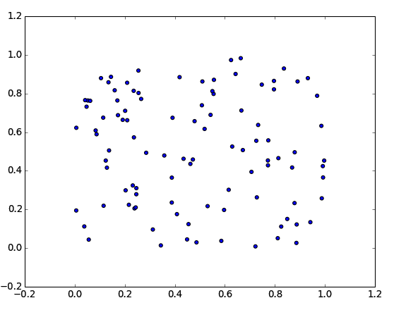
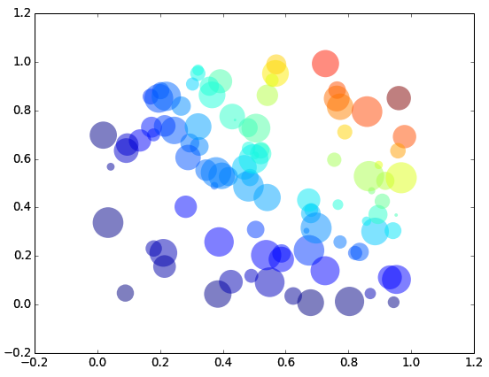
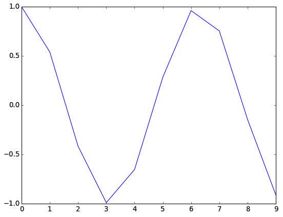

# Plotting with matplotlib

Matplotlib is a standard plotting library in Python. That is, people use it all the time to make 2D or 3D informational graphics. This is not a thorough guide to everything you can do with the library. But a quick introduction to the four major kinds of plots you (as a scientist/engineer) will want to make 99% of the time. The plots are easy to make, and easy to customize. Matplotlib also allows for a dizzying amount of customization, so you can create anything from quick-and-easy plots to publication-quality plots.

## Installing matplotlib

Like most of the libraries used in our "special topics" lectures, matplotlib does not come standard with Python and will have to be installed. Please check the official [SciPy Stack Install Guide](http://www.scipy.org/install.html). For Linux and Mac, the installation is merely a single line of `apt-get`. For Windows, pre-built installers are provided.

## Scatter Plots

First, let's generate a few random data points:

    from numpy import random
    
    N = 100
    x = random.rand(N)
    y = random.rand(N)

Now, we will use those as X and Y values on a scatter plot:

    import matplotlib.pyplot as plt
    plt.scatter(x, y)
    plt.show()

That's it! Once you have the data, it's just three lines to create a scatter plot!

#### Customizations

Those three lines are great. But you're going to want the power to control how that plot looks. So for each type of plot in this lecture we will show some customization options.

#### Color

We can change the color of the dots in several ways:

    # all the same
    plt.scatter(x, y, c='red')
    
    # each different
    plt.scatter(x, y, c=np.random.rand(N))

We can use single letters ('r', 'g', 'b', ...), special words ('red', 'green' 'blue', 'none'), or even numbers from 0.0 to 1.0 to represent colors. And we can provide a single color, or a list of them (one for each point). For more information on color options in matplotlib check the [documentation](http://matplotlib.org/api/colors_api.html) or [these examples](http://matplotlib.org/examples/color/named_colors.html).

#### Size

Much like color, we can provide one value for all data points, or one value for each data point:

    # all the same
    plt.scatter(x, y, s=100)
    
    # each different
    plt.scatter(x, y, s=100 * np.random.rand(N))

The `s` values shown are the area of your dot in pixels. So, if you are using circles, your area is: pi * r * r. If you want to get the exact size you want, calculate the area of the dot you want.

#### Alpha

Perhaps you want your dots to be partially transparent, to help see overlapping dots:

    # all the same
    plt.scatter(x, y, alpha=0.5)
    
    # each different
    plt.scatter(x, y, alpha=np.random.rand(N))

Alpha goes from 0.0 (invisible) to 1.0 (not transparent at all).

#### Edge Colors

If you don't want your dot shapes to have those black edges, you can do:

    # all the same
    plt.scatter(x, y, edgecolors='none')

Of course, if you want, you can change the color of your edges using the same terms you used to change the color of the dots:

    # all the same
    plt.scatter(x, y, edgecolors='b')
    
    # each different
    plt.scatter(x, y, edgecolors=np.random.rand(N))

#### Full Example

Here is the simple scatter plot example above, using several customizations:

    # create random data points
    from numpy import random
    N = 100
    x = random.rand(N)
    y = random.rand(N)

    # plot the data
    import matplotlib.pyplot as plt
    plt.scatter(x, y, c=x*y, s=1000*random.rand(N), alpha=0.5, edgecolor='none')
    plt.show()

## Line Plots

You can use `plot` to take make a line plot out of a series of points:

    # mock up some data
    from numpy import arange, cos
    x = arange(10)
    y = cos(x)
    
    # make a line plot
    import matplotlib.pyplot as plt
    plt.plot(x, y)
    plt.show()

#### Line Style

Your line can be a solid line, or several kinds of dashed lines:

    # dashed line
    plt.plot(x, y, linestyle='--')
    
    # dashed and dotted line
    plt.plot(x, y, linestyle='-.')
    
    # solid line
    plt.plot(x, y, linestyle='-')
    
    # dotted
    plt.plot(x, y, linestyle=':')

#### Line Width

You can also set the width of your line (in pixels):

    # thin (default) line width
    plt.plot(x, y, linewidth=1)
    
    # very thick line
    plt.plot(x, y, linewidth=5)

#### Line Color

You set line color using the same options you used to set scatter plot color, but now you can only provide one color, not many:

    # red line
    plt.plot(x, y, c='red')
    
    # blue line
    plt.plot(x, y, c='b')
    
    # white line
    plt.plot(x, y, c='white')
    
    # green line
    plt.plot(x, y, c='g')

#### Full Example

And now let's pull it all together. We can make a line plot of chosen color, width, and style:

    # mock up some data
    from numpy import arange, cos
    x = arange(10)
    y = cos(x)
    
    # make a line plot
    import matplotlib.pyplot as plt
    plt.plot(x, y, linestyle='-.', linewidth=10, c='red')
    plt.show()

## Bar Charts

 * Coming Soon

You can use `bar` to create vertical bar chart:

    plt.bar(x, y)

Or `barh` to create a horizontal bar chart:

    plt.barh(x, y)

## Histograms

 * Coming Soon

You can `hist` to create a histogram:

    plt.hist(x, 10)

## Pie Charts

 * Coming Soon

## Multiple Plots

 * Coming Soon

## Error Bars

 * Coming Soon

## Common Customizations

 * Coming Soon
 * Coming Soon: Legend
 * Coming Soon: Grid
 * Coming Soon: Axis min, max, and Labels
 * Coming Soon: Title
 * Coming Soon: Save it to a file

## Further Reading

Matplotlib is a powerful tool. But there are so many options for different ways to plot things remembering all of them would be a pain. So I cheat. [Here](http://matplotlib.org/gallery.html) is the cheat sheet: a wonderful collection of matplotlib examples.

 * [matplotlib gallery](http://matplotlib.org/gallery.html)
 * [matplotlib color docs](http://matplotlib.org/api/colors_api.html)
 * [matplotlib color examples](http://matplotlib.org/examples/color/named_colors.html)

[Back to Syllabus](../../README.md)
